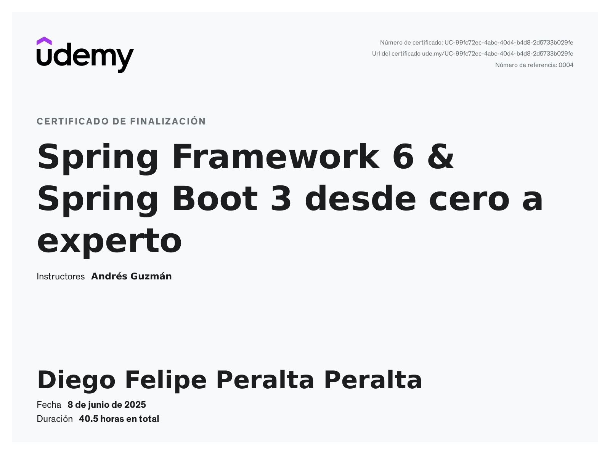

# Spring Framework 6 & Spring Boot 3 - Udemy Course Projects

This repository contains all the projects and notes created during the Udemy course "Spring Framework 6 & Spring Boot 3: From Zero to Expert" by Andrés Guzmán (udemy).

## Udemy Course Certificate

## Course Projects
- `p01-springboot-web`: Project focusing on Spring Boot Web.
- `p02-springboot-di`: Project focusing on Dependency Injection in Spring Boot.
- `p03-springboot-di-factura`: Project focusing on Dependency Injection and Invoices in Spring Boot.
- `p04-springoot-error`: Project focusing on Error Handling in Spring Boot.
- `p05-springboot-interceptor`: Project focusing on Interceptors in Spring Boot.
- `p06-springboot-interceptor-horario`: Project focusing on Interceptors and Schedules in Spring Boot.
- `p07-springboot-aop`: Project focusing on Aspect-Oriented Programming in Spring Boot.
- `p08-sprinboot-jpa`: Project focusing on Spring Boot with JPA.
- `p09-springboot-jpa-relationship`: Project focusing on JPA Relationships in Spring Boot.
- `p10-springboot-crud`: Project focusing on CRUD Operations in Spring Boot.
- `p11-spring-security-jwt`: Project focusing on Spring Security and JWT.
- `p12-auth-server`: Project focusing on Authorization Server with Spring Security.
- `p12-client-app`: Project focusing on Client App with Spring Security.
- `p13-forntend-react-backend-springboot`: Project focusing on Frontend with React and Backend with Spring Boot.
- `p14-frontend-angular-backend-springboot`: Project focusing on Frontend with Angular and Backend with Spring Boot.

## Course Notes
The `1_notas` directory contains detailed notes for various topics covered in the course. These notes are organized into the following main themes:
- Introducción to Spring Boot
- Spring MVC
- Inyección de Dependencias (Dependency Injection)
- Manejo de Errores (Error Handling)
- Interceptores (Interceptors)
- Programación Orientada a Aspectos (AOP - Aspect-Oriented Programming)
- JPA e Hibernate (JPA and Hibernate)
- Proyecto CRUD (CRUD Project)
- JWT (JSON Web Tokens)
- Despliegue (Deployment)